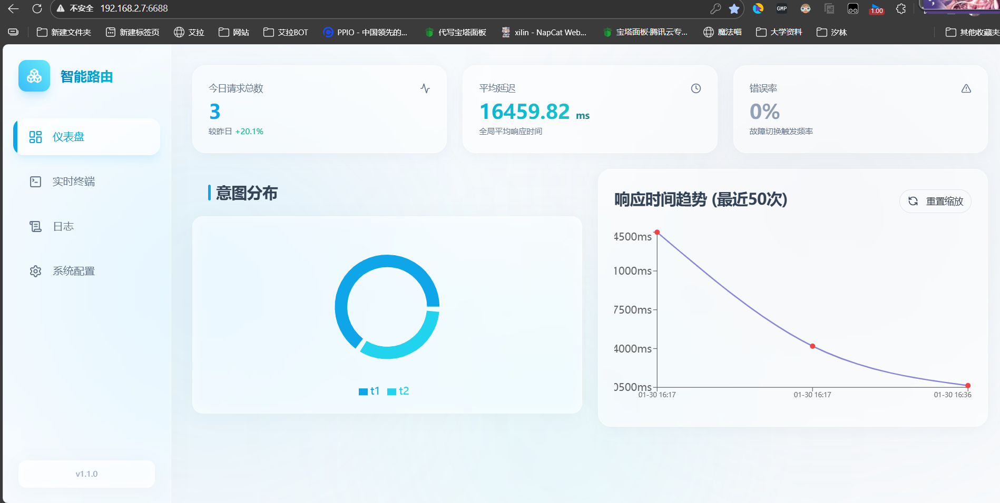

# SmartRoute AI Gateway

[](https://opensource.org/licenses/MIT)
[](https://www.python.org/)
[](https://react.dev/)
[](https://fastapi.tiangolo.com/)

一个现代化的、兼容 OpenAI 协议的智能路由网关。它能根据用户意图复杂度自动分流请求，支持多模型故障转移（Failover），并提供美观的 Web 管理面板。



## 📋 目录

- [核心特性](#-核心特性)
- [项目架构](#-项目架构)
- [快速开始](#-快速开始)
- [配置说明](#-配置说明)
- [API 文档](#-api-文档)
- [常见问题](#-常见问题)
- [技术栈](#-技术栈)
- [贡献指南](#-贡献指南)
- [许可证](#-许可证)

## ✨ 核心特性

*   **⚡ 智能分流 (Intelligent Routing)**:
    *   **T1 (简单)**: 闲聊、短问答 -> 路由至低成本模型。
    *   **T2 (中等)**: 代码生成、文案写作 -> 路由至中等成本模型。
    *   **T3 (复杂)**: 深度推理、复杂逻辑 -> 路由至复杂成本模型。
    *   支持基于**关键词**的快速匹配或**LLM 意图识别**（使用小模型分析用户意图）。

*   **🛡️ 高可用与容错 (High Availability)**:
    *   **智能健康检查**: 引入**时间衰减与动态惩罚机制**，模型错误分值会随时间自动恢复，偶发错误不会导致模型永久被 ban。
    *   **自动故障转移**: 当主模型返回 4xx/5xx 错误或超时，自动无缝切换到备用模型。
    *   **关键词重试**: 即使状态码为 200，若返回内容包含 "rate limit", "overloaded" 等关键词，也会自动重试。
    *   **参数自适应**: 支持为不同模型配置特定的默认参数（如 Kimi 强制 `top_p=0.95`），解决上游兼容性问题。

*   **🔒 企业级安全 (Enterprise Security)**:
    *   **JWT 认证**: 管理后台全站采用 JWT 令牌认证，支持会话管理。
    *   **2FA 双重验证**: 支持 Google Authenticator / TOTP 动态验证码，保护后台安全。
    *   **访问控制**: 细粒度的 Gateway API Key 控制，确保 API 调用安全。

*   **📊 可视化管理面板**:
    *   **实时监控**: QPS、平均响应时间、错误率、模型使用分布。
    *   **日志审计**: 完整记录请求/响应体（JSON），支持流式响应重组记录。
    *   **在线配置**: 随时调整模型列表、超时时间、路由策略，无需重启服务。

*   **🔌 兼容性**:
    *   完全兼容 OpenAI `/v1/chat/completions` 协议。
    *   支持流式（Stream）与非流式响应。
    *   支持自定义网关鉴权（Gateway API Key）。

## 🏗️ 项目架构

```
openai_router/
├── backend/                 # Python 后端服务
│   ├── main.py             # FastAPI 主应用入口
│   ├── router_engine.py    # 核心路由引擎（分流、重试、健康检查）
│   ├── config_manager.py   # 配置管理器
│   ├── database.py         # SQLAlchemy 数据库模型
│   ├── auth.py             # JWT、2FA、密码安全
│   ├── logger.py           # 日志系统
│   ├── config.json         # 配置文件
│   ├── logs.db             # SQLite 数据库
│   └── requirements.txt    # Python 依赖
├── frontend/                # React 前端管理面板
│   ├── src/
│   │   ├── components/     # UI 组件（Dashboard、配置、日志等）
│   │   ├── lib/            # API 调用、工具函数
│   │   └── App.tsx         # 主应用
│   ├── dist/               # 构建产物
│   └── package.json        # Node 依赖
├── start.bat                # Windows 启动脚本
├── start.sh                 # Linux/Mac 启动脚本
└── install.sh               # Linux 一键安装脚本
```

### 核心模块说明

| 模块 | 职责 |
|------|------|
| **Router Engine** | 请求分流、故障转移、模型状态管理、流式响应代理 |
| **Config Manager** | 配置加载/保存、版本迁移、热更新 |
| **Database** | 请求日志、每日统计、配置历史、用户账户 |
| **Auth** | JWT 令牌、TOTP 2FA、密码哈希 |

## ⚙️ 配置说明

### 模型分级配置 (T1/T2/T3)

在 [backend/config.json](file:///f:/AstrBotPlugin/openai_router/backend/config.json) 中配置：

```json
{
  "models": {
    "t1": [{"model": "gpt-4o-mini", "provider": "upstream"}],
    "t2": [{"model": "gpt-4", "provider": "upstream"}],
    "t3": [{"model": "claude-3-opus", "provider": "custom"}]
  }
}
```

- **T1**: 简单问答、闲聊，追求速度和低成本
- **T2**: 代码生成、创意写作，追求平衡
- **T3**: 深度推理、复杂任务，追求最高质量

### 多提供商配置

支持配置多个上游 API 提供商：

```json
{
  "providers": {
    "upstream": {
      "base_url": "https://api.openai.com/v1",
      "api_key": "sk-xxx",
      "protocol": "openai"
    },
    "custom": {
      "base_url": "https://api.anthropic.com/v1",
      "api_key": "sk-ant-xxx",
      "protocol": "openai"
    }
  }
}
```

### 智能路由配置

启用 LLM 意图识别（使用小模型分析用户请求复杂度）：

```json
{
  "router": {
    "enabled": true,
    "model": "gpt-4o-mini",
    "base_url": "https://api.openai.com/v1",
    "api_key": "sk-xxx",
    "prompt_template": "..."
  }
}
```

### 健康检查与重试

```json
{
  "health": {
    "decay_rate": 0.05
  },
  "retries": {
    "max_retries": {"t1": 3, "t2": 3, "t3": 3},
    "conditions": {
      "status_codes": [429, 500, 502, 503, 504],
      "error_keywords": ["rate limit", "overloaded"]
    }
  }
}
```

## 🚀 快速开始

### 1. 快速安装

#### Windows
双击运行目录下的 `start.bat` 即可自动完成环境配置与启动。

#### Linux / macOS
我们提供了一键安装脚本，自动处理环境依赖、构建与启动。

推荐使用以下命令进行快速安装（只需一行）：

```bash
bash <(curl -sL https://raw.githubusercontent.com/luosheng520qaq/smart-route-ai-gateway/main/install.sh)
```

该命令会自动：
1. 检查并安装 Git (如果需要)。
2. 克隆项目代码。
3. 创建 Python 虚拟环境并安装依赖。
4. 自动生成启动脚本。

安装完成后，脚本会提示你如何启动服务。

### 2. 手动部署 (如果不使用脚本)

```bash
cd backend
# 创建虚拟环境
python -m venv venv
# 激活环境 (Windows)
venv\Scripts\activate
# 激活环境 (Linux/Mac)
source venv/bin/activate

# 安装依赖 (注意：包含安全组件)
pip install -r requirements.txt
```

### 3. 前端构建

```bash
cd frontend
npm install
npm run build
```
构建产物会自动生成到 `frontend/dist`，后端将自动托管。

### 4. 启动服务

```bash
cd backend
python main.py
```
服务默认运行在 `http://0.0.0.0:6688`。

## 🔐 默认账号与安全

系统采用**首次登录注册制**，没有预设密码。

1. **默认账号**: `admin`
2. **默认密码**: **首次登录时输入的任意密码**（系统会自动将其注册为永久密码）。
3. **强烈建议**: 首次登录后，请立即前往 **系统配置 -> 安全设置** 开启 **2FA 双重验证**。

## 📝 API 文档

*   **OpenAI 代理接口**: `POST /v1/chat/completions`
    *   认证: `Authorization: Bearer <Gateway-API-Key>` (如果在设置中配置了 Key)
*   **管理后台 API**: `/api/*`
    *   认证: `Authorization: Bearer <JWT-Token>` (通过登录获取)

## 🔄 旧版本升级指南

如果您是从旧版本升级：

1. **备份数据**: 备份 `backend/logs.db` 和 `backend/config.json` (可选)。
2. **更新代码**: 覆盖 `backend/` 和 `frontend/dist/`。
3. **更新依赖**: 务必运行 `pip install -r backend/requirements.txt` 以安装 `passlib`, `python-jose`, `pyotp` 等新依赖。
4. **重启服务**: 数据库会自动迁移，添加用户表。

## ❓ 常见问题 (FAQ)

### Q: 如何修改服务端口？
A: 编辑 [backend/main.py](file:///f:/AstrBotPlugin/openai_router/backend/main.py)，修改 uvicorn 运行的端口。

### Q: 如何设置 Gateway API Key 保护我的代理？
A: 在 Web 管理面板的 **系统配置 -&gt; 通用设置** 中，配置 `gateway_api_key`。之后所有 `/v1/chat/completions` 请求都需要在 Header 中携带 `Authorization: Bearer &lt;key&gt;`。

### Q: 为什么模型被自动降级了？
A: 当模型连续出错时，健康检查机制会增加该模型的失败分值，路由引擎会优先选择分值更低（更健康）的模型。分值会随时间自动衰减恢复。

### Q: 如何重置管理员密码？
A: 删除 `backend/logs.db` 中的用户记录，或直接删除数据库文件重启（会丢失日志），首次登录时输入新密码即可。

### Q: 前端页面无法访问？
A: 确保已构建前端：进入 `frontend` 目录执行 `npm run build`，生成 `frontend/dist` 目录。

## 🛠️ 技术栈

### 后端
- **FastAPI**: 现代异步 Web 框架
- **SQLAlchemy**: ORM + Async SQLite
- **httpx**: 异步 HTTP 客户端
- **pyotp**: TOTP 2FA
- **python-jose**: JWT 令牌
- **passlib**: 密码哈希

### 前端
- **React 19**: UI 框架
- **TypeScript**: 类型安全
- **Vite**: 构建工具
- **Tailwind CSS**: 样式框架
- **shadcn/ui**: UI 组件库
- **Recharts**: 图表库
- **Axios**: HTTP 客户端

## 🤝 贡献指南

欢迎贡献 Issue 和 Pull Request！

### 开发环境搭建

```bash
# 后端开发
cd backend
python -m venv venv
venv\Scripts\activate  # Windows
source venv/bin/activate  # Linux/Mac
pip install -r requirements.txt
python main.py

# 前端开发 (热重载)
cd frontend
npm install
npm run dev  # 访问 http://localhost:5173
```

### 提交规范

- 后端代码修改后请测试 API 功能
- 前端修改后请运行 `npm run build` 更新 `dist`
- 提交信息请清晰描述变更内容

## 📄 许可证

MIT License
